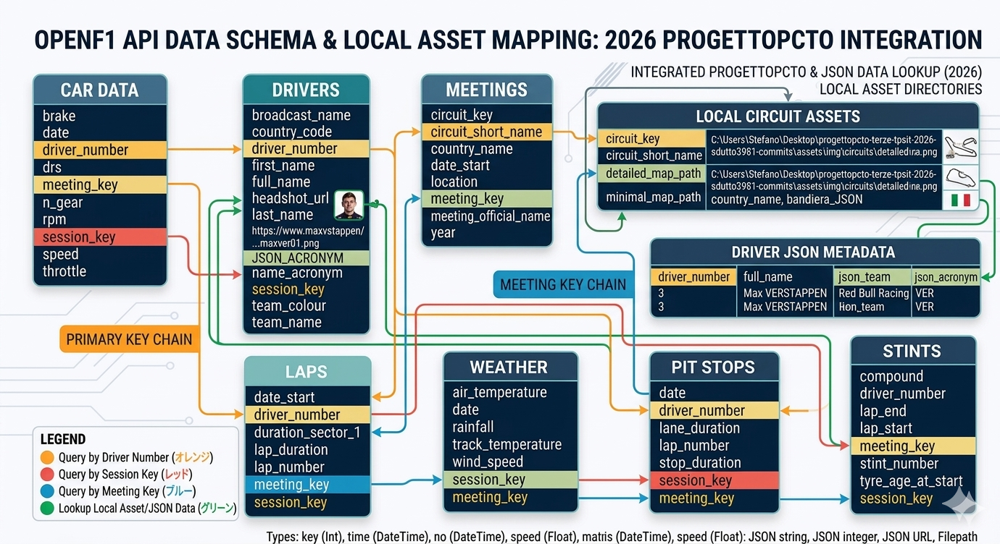

[](https://classroom.github.com/a/Vl8Q9G-2)

# OpenF1 API Documentation



## 1. Car Data

Dati telemetrici di ogni auto con una frequenza di campionamento di circa 3.7 Hz.

**Esempio di richiesta (CURL):**

```bash
curl "https://api.openf1.org/v1/car_data?driver_number=55&session_key=9159&speed>=315"

```

**Esempio Output:**

```json
[
  {
    "brake": 0,
    "date": "2023-09-15T13:08:19.923000+00:00",
    "driver_number": 55,
    "drs": 12,
    "meeting_key": 1219,
    "n_gear": 8,
    "rpm": 11141,
    "session_key": 9159,
    "speed": 315,
    "throttle": 99
  }
]

```

### Attributi

| Nome | Descrizione |
| --- | --- |
| **brake** | Se il pedale del freno è premuto (100) o meno (0). |
| **date** | Data e ora UTC in formato ISO 8601. |
| **driver_number** | Numero univoco assegnato al pilota. |
| **drs** | Stato del Drag Reduction System (vedi tabella sotto). |
| **meeting_key** | Identificativo univoco dell'evento (GP). |
| **n_gear** | Marcia inserita (1-8). 0 indica folle. |
| **rpm** | Giri al minuto del motore. |
| **speed** | Velocità dell'auto in km/h. |
| **throttle** | Percentuale di utilizzo dell'acceleratore. |

### Tabella Valori DRS

| Valore | Interpretazione |
| --- | --- |
| 0, 1, 2, 3 | DRS Off |
| 8 | Rilevato, attivabile in zona DRS |
| 10, 12, 14 | DRS On |

---

## 2. Drivers Championship (Beta)

Classifica piloti in tempo reale (solo durante le sessioni di gara).

**Esempio di richiesta:**

```bash
curl "https://api.openf1.org/v1/championship_drivers?session_key=9839&driver_number=4"

```

### Attributi principali

* **points_current**: Punti totali durante/dopo la gara.
* **points_start**: Punti prima dell'inizio della gara.
* **position_current**: Posizione in classifica attuale.

---

## 3. Drivers

Dettagli sui piloti partecipanti a una specifica sessione.

**Esempio Output:**

```json
{
  "broadcast_name": "M VERSTAPPEN",
  "driver_number": 1,
  "full_name": "Max VERSTAPPEN",
  "name_acronym": "VER",
  "team_colour": "3671C6",
  "team_name": "Red Bull Racing"
}

```

---

## 4. Intervals

Intervalli in tempo reale tra i piloti e distacco dal leader. Aggiornato ogni 4 secondi.

### Attributi

| Nome | Descrizione |
| --- | --- |
| **gap_to_leader** | Distacco dal primo in secondi (o "+1 LAP"). |
| **interval** | Distacco dall'auto precedente in secondi. |

---

## 5. Laps

Dati dettagliati sui tempi sul giro e settori.

### Attributi

* **duration_sector_1/2/3**: Tempo dei singoli settori.
* **lap_duration**: Tempo totale del giro.
* **st_speed**: Velocità alla "Speed Trap".
* **is_pit_out_lap**: Indica se è un giro di uscita dai box.

### Significato Mini-Settori (Segments)

| Valore | Colore | Significato |
| --- | --- | --- |
| 2048 | Giallo | Settore lento/Bandiera |
| 2049 | Verde | Miglioramento personale |
| 2051 | Viola | Record assoluto della sessione |
| 2064 | Pitlane | Auto nei box |

---

## 6. Location

Coordinate X, Y, Z dell'auto sul circuito (3.7 Hz). Utile per mappe 2D/3D.

---

## 7. Meetings & Sessions

Informazioni sugli eventi (Gran Premi) e le singole sessioni (FP1, Qualifiche, Gara).

**Filtro per anno:** `https://api.openf1.org/v1/meetings?year=2026`

---

## 8. Pit Stops

Dati sui passaggi in corsia box.

* **lane_duration**: Tempo totale speso nella pit lane.
* **stop_duration**: Tempo effettivo in cui l'auto è rimasta ferma sulla piazzola.

---

## 9. Race Control

Messaggi ufficiali della direzione gara (Bandiere, Safety Car, Investigazioni).

**Esempio Messaggio:** `"BLACK AND WHITE FLAG FOR CAR 1 (VER) - TRACK LIMITS"`

---

## 10. Stints

Dettagli sui set di gomme usati.

| Nome | Descrizione |
| --- | --- |
| **compound** | Mescola utilizzata (SOFT, MEDIUM, HARD, INTERMEDIATE, WET). |
| **tyre_age_at_start** | Età della gomma (in giri) all'inizio dello stint. |

---

## 11. Weather

Condizioni meteo aggiornate ogni minuto.

### Parametri

* **air_temperature / track_temperature**: Temperatura aria e asfalto.
* **rainfall**: Presenza di pioggia (0 o 1).
* **wind_speed / wind_direction**: Velocità e direzione del vento.